# WebRTC Examples

A collection of WebRTC examples demonstrating various features and patterns, with both **Node.js** and **Dart** signaling servers.

## Examples

| Example | Description |
|---------|-------------|
| [Basic Peer Connection](#basic-peer) | Simple peer-to-peer video call between two browsers |
| [Audio Only](#audio-only) | Audio-only WebRTC connection without video |
| [Video Only](#video-only) | Video-only WebRTC connection without audio |
| [Audio + Video (Bundled)](#audio-video-bundled) | Audio and video on a single transport (BUNDLE) |
| [Audio + Video (Unbundled)](#audio-video-unbundled) | Audio and video on separate transports |
| [Audio/Video Capture](#audio-video-capture) | Capture and display local audio/video streams |
| [Screen Sharing](#screen-sharing) | Share screen content via WebRTC |
| [Speech to Text](#speech-to-text) | Stream audio to server for real-time speech-to-text |
| [DataChannel (TCP-like)](#data-channel-tcp) | Reliable, ordered data channel messaging |
| [DataChannel (UDP-like)](#data-channel-udp) | Unreliable, unordered data channel for real-time data |
| [Renegotiation](#renegotiation) | Add/remove tracks mid-call without disconnecting |
| [Network Interruptions](#network-interruptions) | Handle connection state changes and recovery |
| [Multi-Peer](#multi-peer) | Multiple peers sending audio to a central receiver |
| [Stats Dashboard](#stats-dashboard) | Real-time WebRTC metrics: bitrate, FPS, RTT, packet loss |

## Running Examples

Each example can be run with either Node.js or Dart server:

```bash
# Using Node.js server
cd example_name
./run.sh

# Using Dart server
cd example_name
./run.sh dart
```

## Requirements

- Node.js 18+
- Dart 3.0+
- Playwright (for automated tests)
- ffmpeg (for some examples)

```bash
npm install
```

---

## Basic Peer Connection

**Directory:** `basic_peer/`

Simple peer-to-peer video call between two browsers

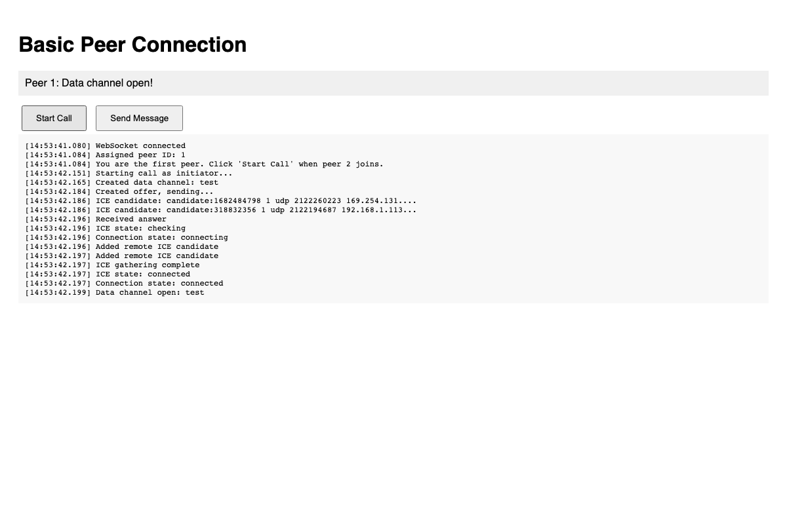

```bash
cd basic_peer
./run.sh dart
```

---

## Audio Only

**Directory:** `audio_only/`

Audio-only WebRTC connection without video

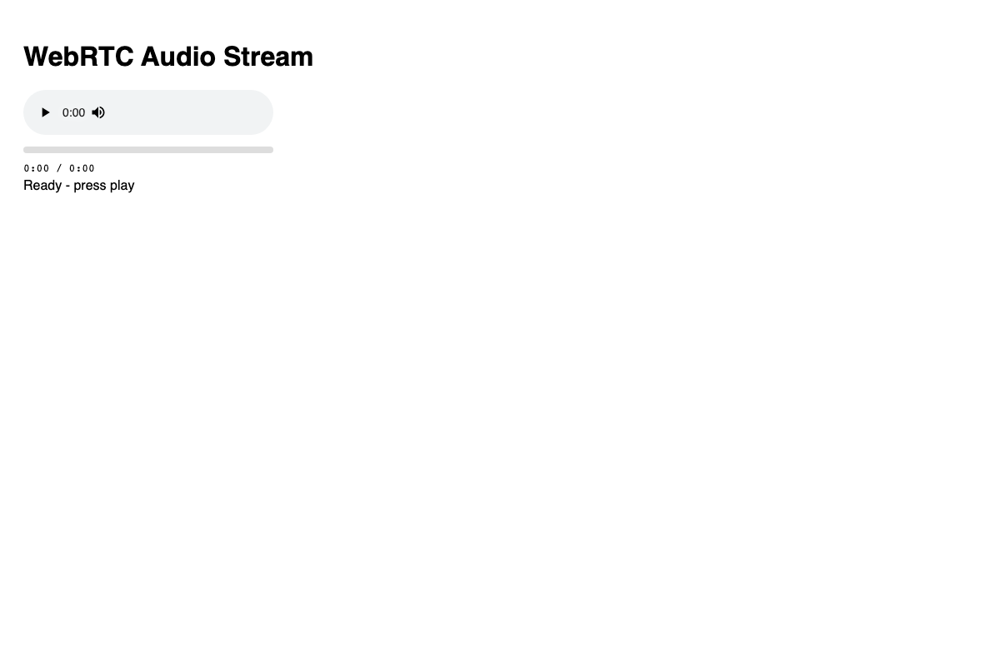

```bash
cd audio_only
./run.sh dart
```

---

## Video Only

**Directory:** `video_only/`

Video-only WebRTC connection without audio

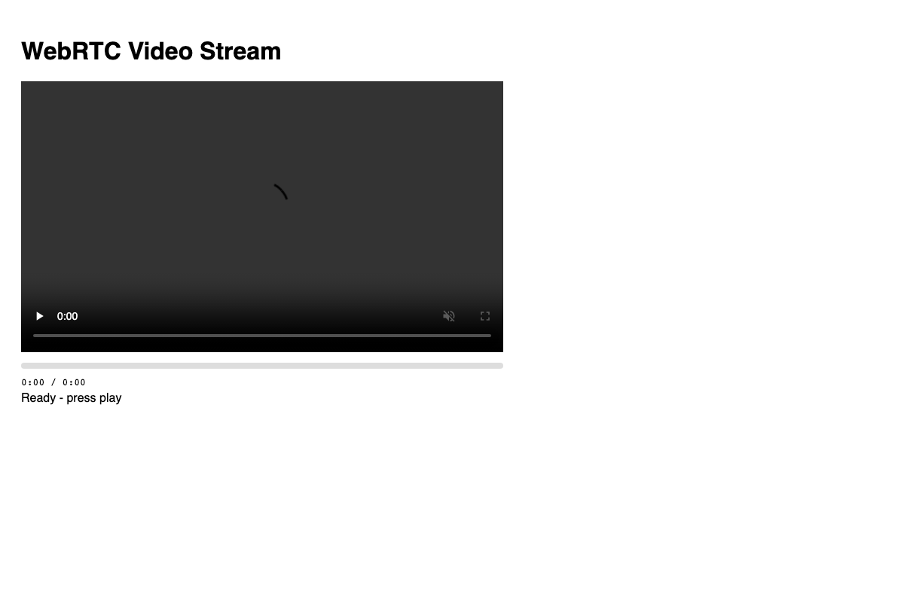

```bash
cd video_only
./run.sh dart
```

---

## Audio + Video (Bundled)

**Directory:** `audio_video_bundled/`

Audio and video on a single transport (BUNDLE)

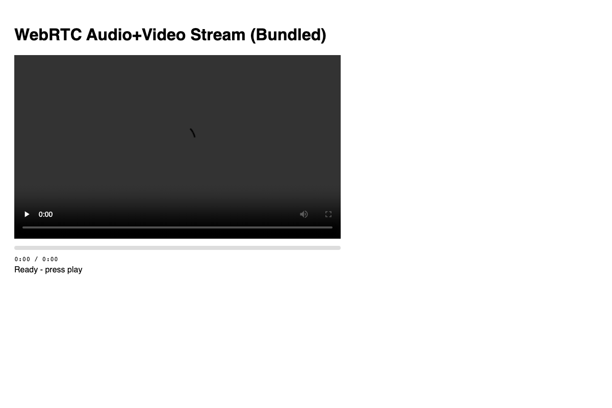

```bash
cd audio_video_bundled
./run.sh dart
```

---

## Audio + Video (Unbundled)

**Directory:** `audio_video_unbundled/`

Audio and video on separate transports

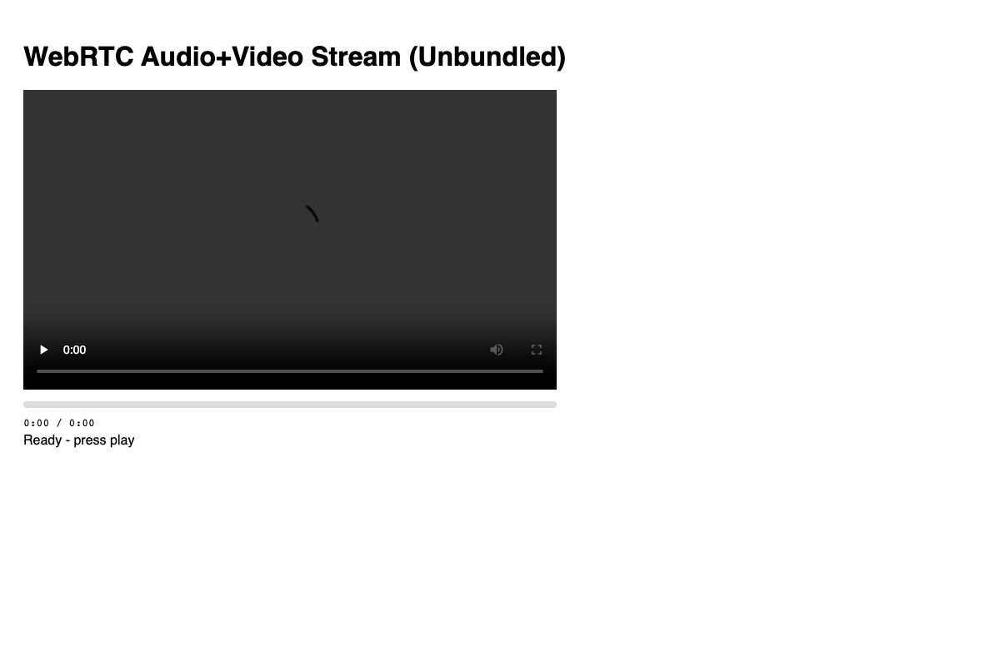

```bash
cd audio_video_unbundled
./run.sh dart
```

---

## Audio/Video Capture

**Directory:** `audio_video_capture/`

Capture and display local audio/video streams

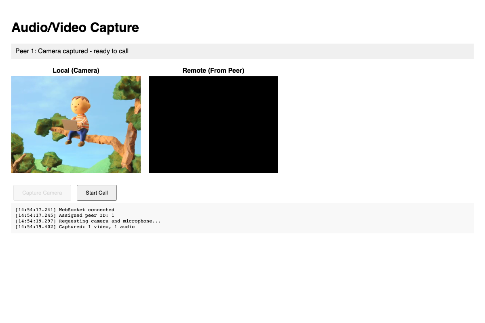

```bash
cd audio_video_capture
./run.sh dart
```

---

## Screen Sharing

**Directory:** `screen_sharing/`

Share screen content via WebRTC

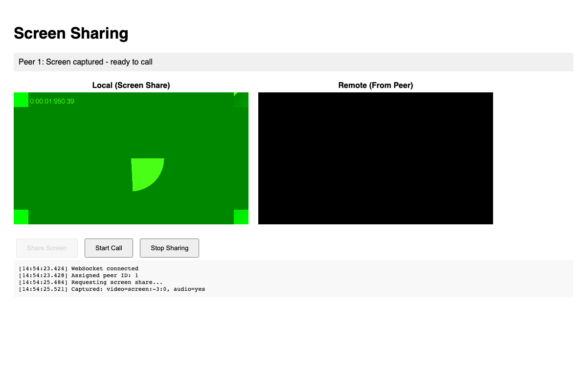

```bash
cd screen_sharing
./run.sh dart
```

---

## DataChannel (TCP-like)

**Directory:** `data_channel_tcp/`

Reliable, ordered data channel messaging

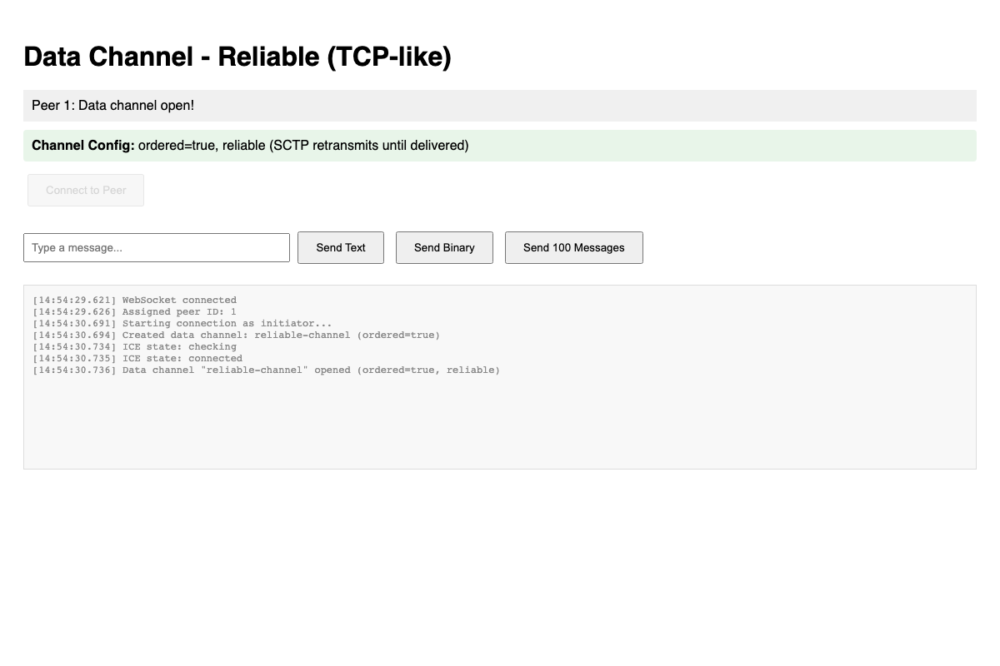

```bash
cd data_channel_tcp
./run.sh dart
```

---

## DataChannel (UDP-like)

**Directory:** `data_channel_udp/`

Unreliable, unordered data channel for real-time data

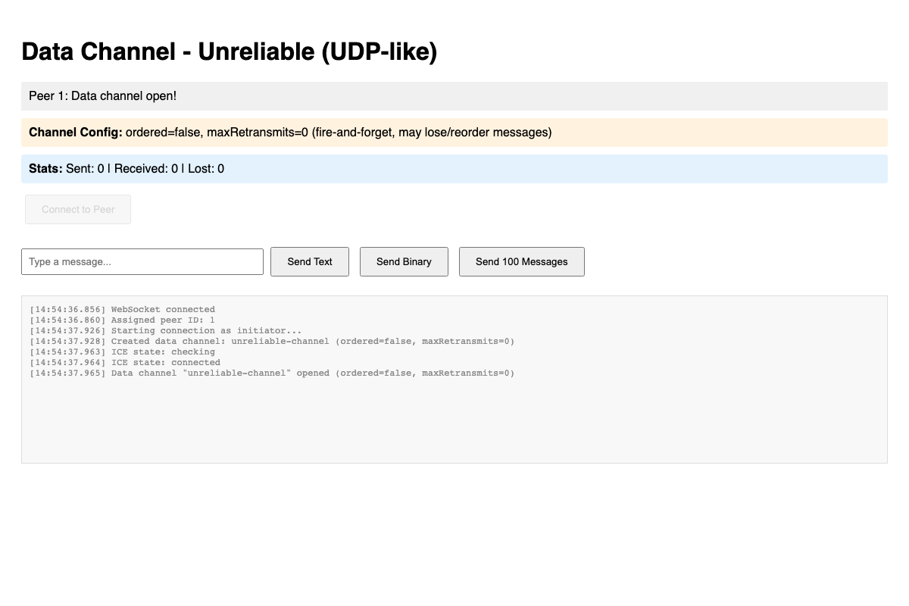

```bash
cd data_channel_udp
./run.sh dart
```

---

## Renegotiation

**Directory:** `renegotiation/`

Add/remove tracks mid-call without disconnecting

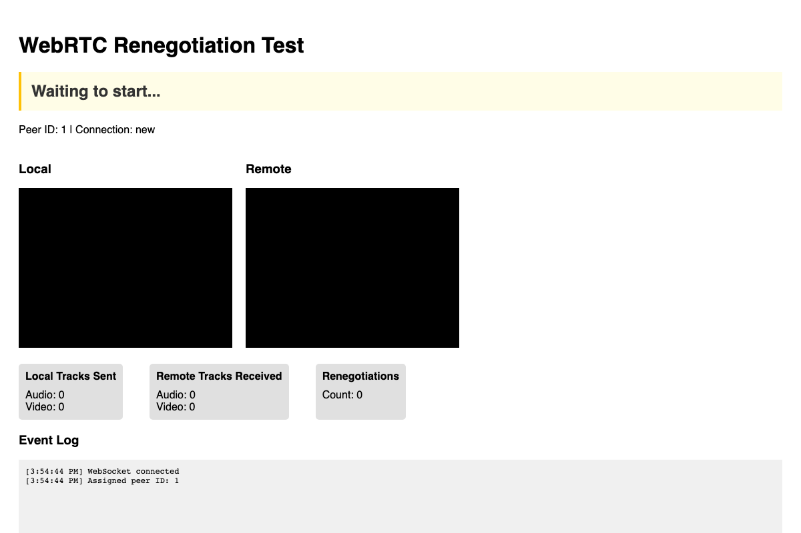

```bash
cd renegotiation
./run.sh dart
```

---

## Network Interruptions

**Directory:** `network_interruptions/`

Handle connection state changes and recovery

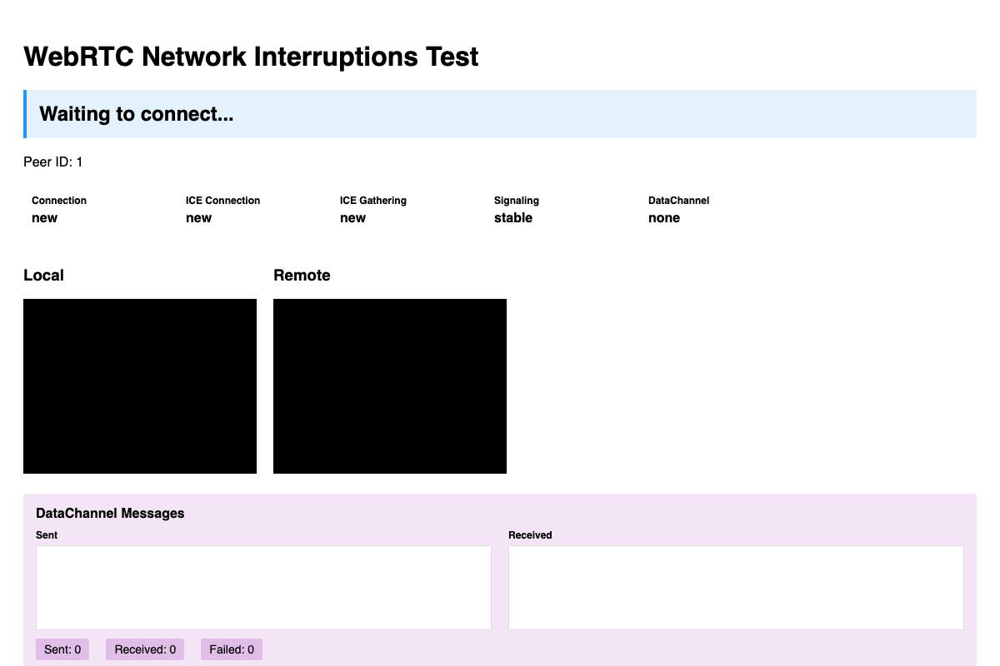

```bash
cd network_interruptions
./run.sh dart
```

---

## Multi-Peer

**Directory:** `multi_peer/`

Multiple peers sending audio to a central receiver

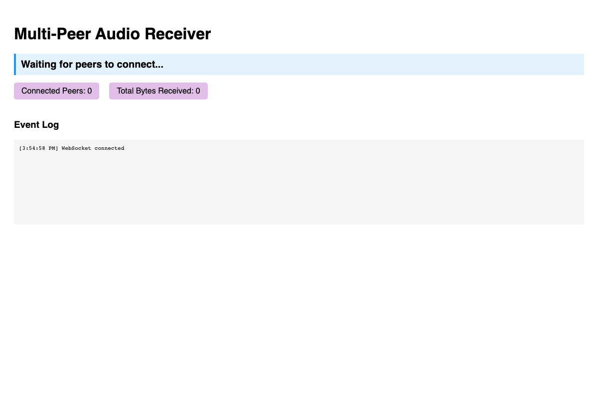

```bash
cd multi_peer
./run.sh dart
```

---

## Speech to Text

**Directory:** `speech_to_text/`

Stream audio from multiple browser clients to server for real-time speech-to-text transcription using Whisper

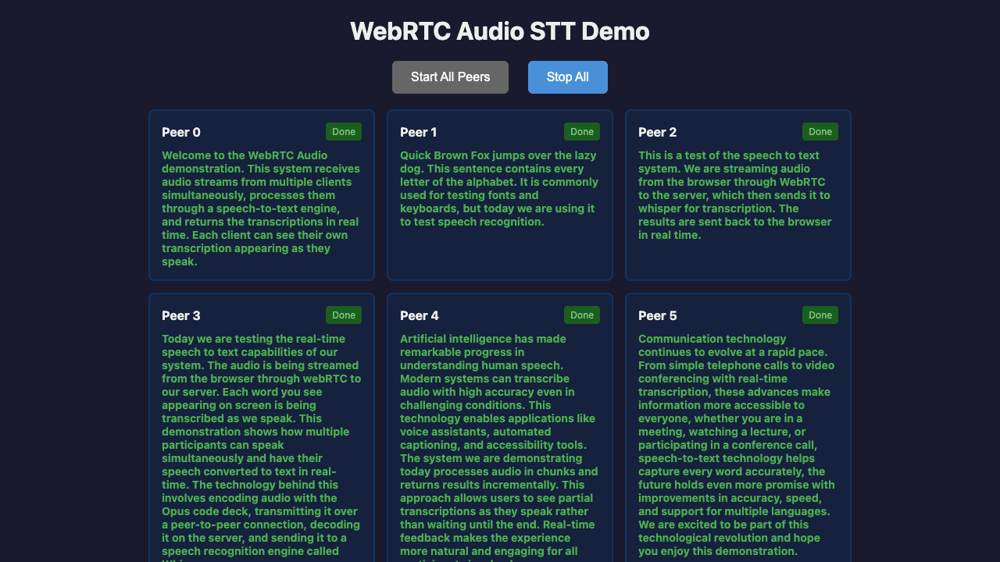

```bash
cd speech_to_text
./run.sh dart
```

---

## Stats Dashboard

**Directory:** `stats_dashboard/`

Real-time WebRTC metrics: bitrate, FPS, RTT, packet loss

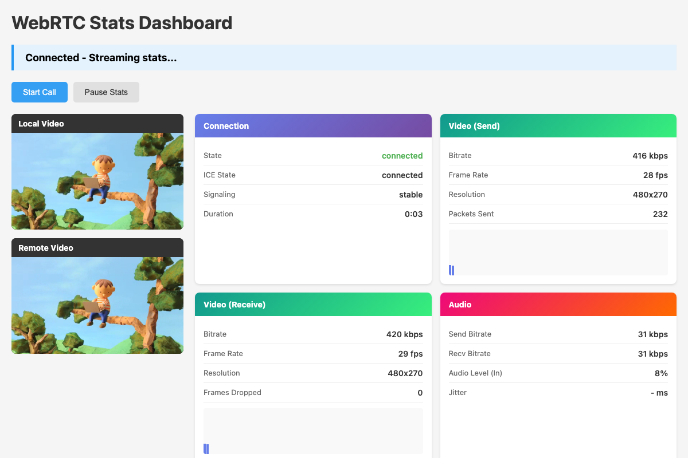

```bash
cd stats_dashboard
./run.sh dart
```

---

## Acknowledgments

Audio and video samples used in these examples are borrowed from:
- [WebRTC Samples](https://github.com/webrtc/samples) - Video and audio test files
- [sherpa-onnx-kws-zipformer-gigaspeech-3.3M-2024-01-01](https://github.com/k2-fsa/sherpa-onnx) test_wavs - Audio keyword samples

## License

MIT
